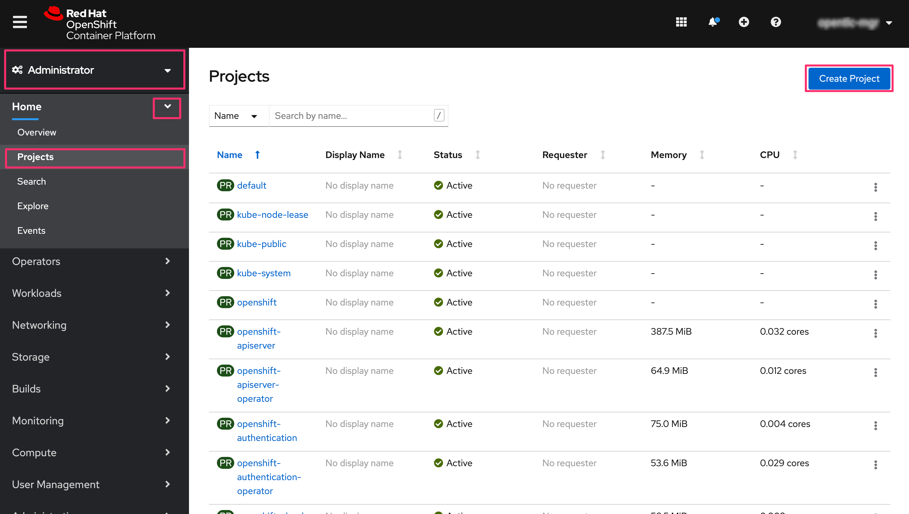
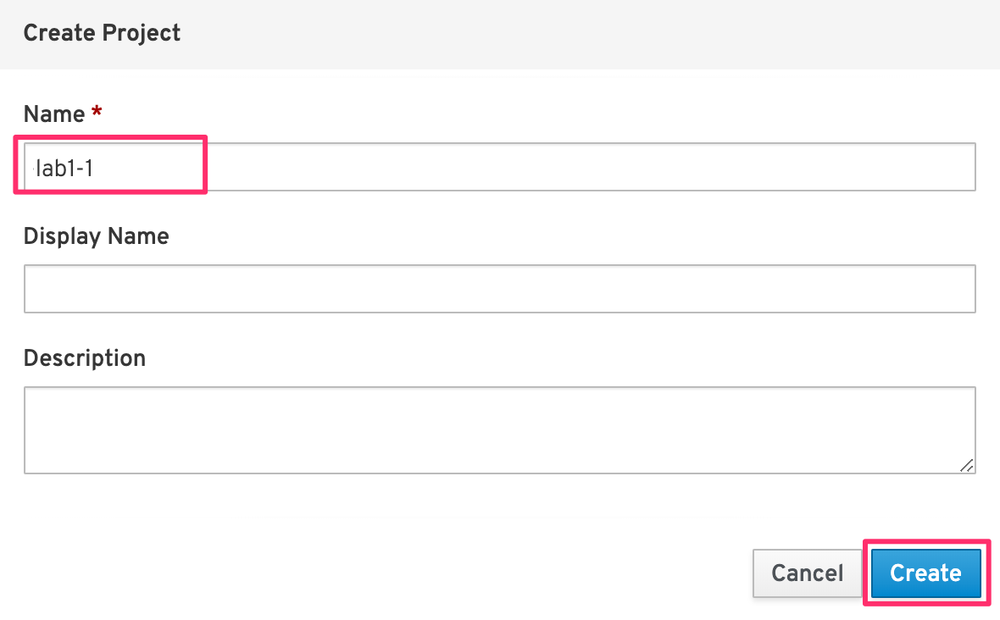
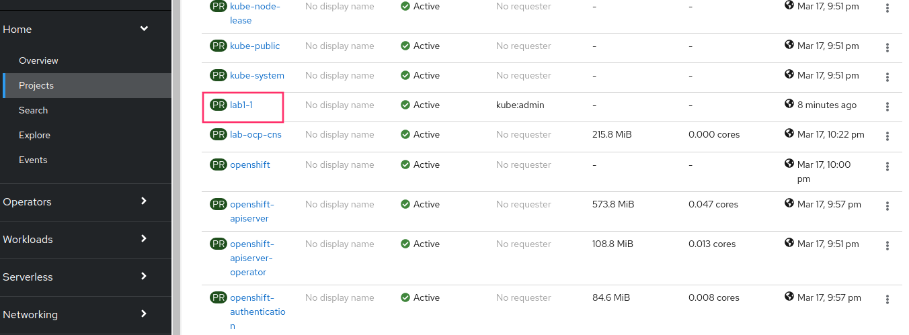

= 演習1 Lab1-1: OpenShift4クラスターへのログインと動作確認

各自のOpenShift4クラスターに実際に接続し、クラスター内コンポーネントの動作確認を次の手順で行います。

* A) OpenShift4クラスターへのログイン (2)
* B) プロジェクト(openshift-console)のリソース利用状況の確認 (3-1)
* C) クラスターを構成するNodeの確認 (3-2)
* D) K8sワークロード の動作確認 (3-3)

image::images/ocp4ws-ops/ocp4-Lab1-2_overview.png[]

'''

== 1. 諸注意

=== 1-1. OpenShift4へのログイン方法
* *ocコマンド* : kubectlをwrapしたOpenShift4を制御するCLIでログイン
 ** `oc login <OpenShift_API>`: 任意のユーザーでログイン
 ** `oc get pods -n default`: defaultネームスペースのPodを一覧表示
 ** `kubectl get pods -n default` : kubectlも使用可
 ** etc.
* *OpenShift4コンソール* : OpenShift4の専用コンソール画面にブラウザからログイン
 ** PodやDeployment、Secretなどのワークロードや、ServiceやPVCなどの作成および編集
 ** ワークロードやNodeの状態確認やモニタリング
 ** カタログからのミドルウェア、アプリケーションのデプロイ
 ** クラスター設定やネームスペース、ロール管理などのAdmin作業
 ** etc.

=== 1-2. 事前準備
* 踏み台サーバー(Bastion Server)へのアクセス情報
* OpenShift4クラスターへのアクセス情報

== 2. OpenShift4へのログイン

=== 2-1. ocコマンドによるログイン(oc login)

. 踏み台サーバー(Bastion Server)にSSHでログインします。
+
[source,bash,role="execute"]
----
ssh -l {{ SSH_USERNAME }} {{ BASTION_FQDN }} -o ServerAliveInterval=120
----
+
あなたの ssh パスワードはこれです。
+
[source,bash,role="copypaste"]
----
{{ SSH_PASSWORD }}
----
+
. OpenShift4クラスターにocコマンドでログインします。
+
[source,bash,role="execute"]
----
oc login -u kubeadmin -p {{ KUBEADMIN_PASSWORD }} {{ API_URL }} 
----

=== 2-2. OpenShift4 Webコンソールへのログイン

次のリンクをクリックしてブラウザ(Chrome or Firefox)でOpenShift4 Webコンソールにログインします。

{{ MASTER_URL }}

`kubeadmin` としてログインしましょう。パスワードはこちらです。

[source,role="copypaste"]
----
{{ KUBEADMIN_PASSWORD }}
----

Privacy Errorが出た場合は、[Advanced] > [Proceed to oauth-openshift.apps.xxx... (unsafe)] のように選択して進めてください。

image::images/ocp4ws-ops/ocp4-console-login-error.png[]

== 3. OpenShift4クラスターの動作確認

コンソールやocコマンドでクラスターの状態について確認しましょう。基本的には**参照系のみ(oc get pod, oc describe deploy, oc logs xxx, etc.)を使用**します。

OpenShift4コンソールで各自のプロジェクトを作成しましょう。

. [Administrator] > [Home] > [Projects] > [Create Project] を選択します。
+
image::images/ocp4ws-ops/ocp4-console-create-project-1.png[]
+

+
. 好きなプロジェクト名(例: `lab1-2` )を指定し、*Create* を選択します。
+

+
image::images/ocp4ws-ops/ocp4-console-create-project-3.png[]

=== 3-1. プロジェクトのリソース利用状況の確認

最初に、前の手順で作成した自身のプロジェクトを確認してみましょう。 +
その後、`openshift-consoleプロジェクト` のリソース利用状況を確認します。

. [Administrator] > [Home] > [Projects] > [自身のプロジェクト (例: lab1-2) ] を選択します。
+

+
以下のような画面が表示されます。ただ、作成したばかりのプロジェクトなので特に情報がありません。
+
image::images/ocp4ws-ops/ocp4-console-project-status.png[]

. 次に、[Administrator] > [Home] > [Projects] > [openshift-console] を選択します。
+
image::images/ocp4ws-ops/ocp4-console-project-openshift-console.png[]
+
openshift-consoleプロジェクトにおけるCPUやメモリなどのリソース利用状況が確認できました。 +
さらに下方では、Podによるメモリ利用量と、利用量の大きい順にTOP10が一覧表示されています。
+
image::images/ocp4ws-ops/ocp4-console-project-openshift-console-status.png[]

. openshift-consoleプロジェクトの利用状況について詳細に見ていきます。
+
グラフ内にカーソルを合わせて選択します。
+
image::images/ocp4ws-ops/ocp4-console-project-openshift-console-status-next.png[]
+
CPU利用量を示したグラフが表示されているはずです。OpenShiftのUIに組み込まれたPrometheusを使用しています。 +
 次に、[Prometheus UI] を選択して、Prometheusに直接アクセスしてみましょう。
+
image::images/ocp4ws-ops/ocp4-console-project-openshift-console-status-prometheus.png[]
+
ログインを求められた場合は、OpenShift4クラスターへのログイン情報を使用します。
+
image::images/ocp4ws-ops/ocp4-console-project-openshift-console-status-login.png[]
+
Authorized Accessのページが表示されたら、[Allow selected permissions]を選択します。
+
[TIPS]
====
NOTE: モニタリングツール(Prometheus)に対して、ReadOnlyで情報利用する許可を与えています。

image::images/ocp4ws-ops/ocp4-console-project-openshift-console-status-allow.png[]
====
+
openshift-consoleプロジェクト(=openshift-consoleネームスペース)内のコンテナCPU利用量のグラフが描画されました。
+
image::images/ocp4ws-ops/ocp4-console-project-openshift-console-status-prometheus-cpu-usage.png[]
+
[TIPS]
====
NOTE: 折れ線グラフにカーソルを合わせると詳細情報が表示されます。
Prometheusに対して、以下のQueryを投げることで上図の情報を抽出しています。 +
`Query: namespaces:container_cpu_usage:sum{namespace='openshift-console'}`
====

. 任意のメトリクスを指定して描画してみます。
+
入力済のクエリを削除してブランクにしてから、[- insert metric at cursol -] を選択します。
+
image::images/ocp4ws-ops/ocp4-console-project-openshift-console-status-prometheus-add-1.png[]
+
例では、[controller_runtime_reconcile_total] > Execute を選択します。
+
image::images/ocp4ws-ops/ocp4-console-project-openshift-console-status-prometheus-add-2.png[]
+
以下図のように折れ線グラフが描画され、下部にはリクエストが一覧されています。カーソルをグラフなどに合わせて詳細情報を確認してみましょう。
+
[TIPS]
====
NOTE: もしうまく描画されない場合は、検索クエリが正しく指定されているか("controller_runtime_reconcile_total")を確認してみましょう。

image::images/ocp4ws-ops/ocp4-console-project-openshift-console-status-prometheus-add-3.png[]
====
+
[TIPS]
====
NOTE: OpenShift4では、各プロジェクト(ネームスペース)に属するあらゆるリソースのメトリクスを初期状態で取得できるようになっています。PrometheusやGrafanaなどを使うことでモニタリングおよび描画を実現しています。
====
+
[Administrator] > [Monitoring] > [Dashboards]で Grafana UIの確認も可能です。
+
image::images/ocp4ws-ops/ocp4-console-project-openshift-console-monitoring.png[]

. 現在開いているタブ（Prometheus UI (あるいはGrafana)の可視化）は、**モニタリングやロギングなど短期間で更新のある可視化画面であるため、ブラウザに負荷がかかります。**このため、必ずクローズしておきましょう。

=== 3-2. クラスターを構成するNodeの確認

OpenShift4クラスターはIPIでデフォルト構成でインストールされた場合、Master3台/Worker3台の計6台のNode群で構成されます。 +
Nodeの状態について確認してみましょう。

*※ノード台数や構成は変更できます。ハンズオン実施時は6台構成ではない場合もあります。*

[CAUTION]
====
**
* Node確認については参照系のみ +
* 変更は行わないこと
**
====

. [Administrator] > [Compute] > [Nodes] を選択します。
+
image::images/ocp4ws-ops/ocp4-lab1-2-node.png[]

. 任意のWorkerを選択して詳細を確認します。
+
[TIPS]
====
NOTE: `ip-10-0-139-202.ap-southeast-1.compute.internal` のような名称で、Node群が一覧されています。また、Role欄を見ると `master`/``worker``の割当を確認できます。※Node数や名称は一例です。
====
+
image::images/ocp4ws-ops/ocp4-lab1-2-node-worker.png[]
+
[Overview]タブでは、選択した単一のNodeのCPUやメモリなどのリソース利用状況が確認できます。 +
プロジェクトと同様に、OpenShift4にデフォルト構成されているPrometheusが各メトリクスを抽出しています。
+
image::images/ocp4ws-ops/ocp4-lab1-2-node-worker-detail.png[]
+
[YAML]タブでは、OpenShift4上で管理されるNode情報をyaml形式で確認できます。ノード名やアノテーション、ラベルなどの記載があります。
+
image::images/ocp4ws-ops/ocp4-lab1-2-node-confirm-detail-yaml.png[]
+
[Pods]タブでは、指定したNode上で動作するPod一覧を確認できます。 +
例えば、``openshift-monitoringネームスペース``に属するgrafanaのPodや、alertManagerなどが動作していることが分かります。
+
image::images/ocp4ws-ops/ocp4-lab1-2-node-confirm-detail-pod.png[]
+
[Events]タブでは、Nodeに起こったイベントについて時系列に表示されます。現時点では何も起こっていないので出力はありませんが、Nodeのステータスが変わったり、例えば割当リソースが変わったりなどの変化が起こると出力されます。

. Nodeに対する操作(Action)を以下図のようにメニューを開いて確認します。
+
image::images/ocp4ws-ops/ocp4-lab1-2-node-confirm-action.png[]
+
ラベルの追加や削除などの変更をUI上で簡易的に行えます。 +
今回は編集しないので、*[Cancel]* を選択してクローズします。
+
image::images/ocp4ws-ops/ocp4-lab1-2-node-confirm-action-label.png[]
+
アノテーションの追加や削除などの変更をUI上で簡易的に行えます。 +
今回は編集しないので、*[Cancel]* を選択してクローズします。
+
image::images/ocp4ws-ops/ocp4-lab1-2-node-confirm-action-annotation.png[]
+
Node構成について、yamlを直接編集して変更が行えます。 +
今回は編集しないので、*[Cancel]* を選択してクローズします。
+
image::images/ocp4ws-ops/ocp4-lab1-2-node-confirm-action-node.png[]
+
[Mark as Unschedulable] を選択することで、今後新しいPodが該当Nodeにスケジューリングされないように設定できます。 +
今回は編集しないので、*[Cancel]* を選択してクローズします。
+
image::images/ocp4ws-ops/ocp4-lab1-2-node-confirm-action-unschedulable.png[]

コンソール上で、OpenShift4クラスターを構成するNodeの数や種類、付与されたラベル、リソース利用状況、あるNode上で動作中のPod、Nodeの構成変更、などについて確認しました。

=== 3-3. K8sワークロード の動作確認 (ocコマンド使用)

ocコマンドを使用して、K8sワークロードの動作状況を確認してみましょう。

. クラスターに含まれるプロジェクトを一覧します。
+
[source,bash,role="execute"]
----
oc get project
----
+
実行例)
+
----
$ oc get project
NAME                                               DISPLAY NAME        STATUS
default                                                                Active
kube-node-lease                                                        Active
kube-public                                                            Active
kube-system                                                            Active
openshift                                                              Active
openshift-apiserver                                                    Active
openshift-apiserver-operator                                           Active
openshift-authentication                                               Active
openshift-authentication-operator                                      Active
openshift-cloud-credential-operator                                    Active
openshift-cluster-machine-approver                                     Active
openshift-cluster-node-tuning-operator                                 Active
openshift-cluster-samples-operator                                     Active
openshift-cluster-storage-operator                                     Active
openshift-cluster-version                                              Active
openshift-config                                                       Active
openshift-config-managed                                               Active
openshift-config-operator                                              Active
openshift-console                                                      Active
openshift-console-operator                                             Active
openshift-controller-manager                                           Active
openshift-controller-manager-operator                                  Active
openshift-dns                                                          Active
openshift-dns-operator                                                 Active
openshift-etcd                                                         Active
openshift-etcd-operator                                                Active
openshift-image-registry                                               Active
openshift-infra                                                        Active
openshift-ingress                                                      Active
openshift-ingress-operator                                             Active
openshift-insights                                                     Active
openshift-kni-infra                                                    Active
openshift-kube-apiserver                                               Active
openshift-kube-apiserver-operator                                      Active
openshift-kube-controller-manager                                      Active
openshift-kube-controller-manager-operator                             Active
openshift-kube-scheduler                                               Active
openshift-kube-scheduler-operator                                      Active
openshift-kube-storage-version-migrator                                Active
openshift-kube-storage-version-migrator-operaor                        Active
openshift-machine-api                                                  Active
openshift-machine-config-operator                                      Active
openshift-marketplace                                                  Active
openshift-monitoring                                                   Active
openshift-multus                                                       Active
openshift-network-operator                                             Active
openshift-node                                                         Active
openshift-openstack-infra                                              Active
openshift-operator-lifecycle-manager                                   Active
openshift-operators                                                    Active
openshift-ovirt-infra                                                  Active
openshift-sdn                                                          Active
openshift-service-ca                                                   Active
openshift-service-ca-operator                                          Active
openshift-service-catalog-removed                                      Active
openshift-user-workload-monitoring                                     Active
openshift-vsphere-infra                                                Active
terminal                                           Workshop Terminal   Active
lab1-2                                                                 Active
----
+
. 1-3. で作成した自身のプロジェクトを検索し、操作対象として切替えます。
+
[source,bash,role="copypaste"]
----
oc get project | grep <Replace-with-your-project>
----
+
実行例)
+
----
$ oc get project | grep lab1-2
lab1-2                                                                 Active
----
+
プロジェクトを切替えて操作してみましょう。
+
[source,bash,role="copypaste"]
----
oc project <Replace-with-your-project>
----
+
実行例)
+
----
$ oc project lab1-2
Now using project "lab1-2" on server "https://api.group00-ocp4ws-basic.capsmalt.org:6443".
----
+
[TIPS]
====
NOTE: `$ oc project` でプロジェクト（ネームスペース）を指定しておくことで、``-n lab1-2`` のようにコマンド実行時に毎度ネームスペース指定をする必要が無くなるため幾分便利になります。 +
※ただし、本ハンズオンの実行例においては、``$ oc project +++<プロジェクト名>+++` の実行有無に関係無く `-n` オプションを付与しています。+++</プロジェクト名>+++
====
+
. 自身のプロジェクト内のワークロードを確認します。
+
[TIPS]
====
CAUTION: コマンド実行時は、`-n <各自のプロジェクト名>` に読み替えてください。
====
+
[source,bash,role="copypasete"]
----
oc get po -n <Replace-with-you-project>
----
+
[source,bash,role="copypasete"]
----
oc get deploy -n <Replace-with-you-project>
----
+
[source,bash,role="copypasete"]
----
oc get svc -n <Replace-with-you-project>
----
+
実行例)
+
----
$ oc get po -n lab1-2
No resources found.

$ oc get deploy -n lab1-2
No resources found.

$ oc get svc -n lab1-2
No resources found.
----
+
自身のプロジェクトでは、まだ何もK8sワークロードを作成していないため、上記例の通り "No resource found." が出力されます。
+
. openshift-console プロジェクト のワークロードを確認します。
+
[source,bash,role="execute"]
----
oc get po -n openshift-console
----
+
[source,bash,role="execute"]
----
oc get deploy -n openshift-console
----
+
[source,bash,role="execute"]
----
oc get svc -n openshift-console
----
+
実行例)
+
----
$ oc get po -n openshift-console
NAME                         READY   STATUS    RESTARTS   AGE
console-855bff5f9c-rhnmm     1/1     Running   0          16h
console-855bff5f9c-xvttg     1/1     Running   1          16h
downloads-5dc69d497c-7kvxb   1/1     Running   0          16h
downloads-5dc69d497c-dxvz7   1/1     Running   0          16h

$ oc get deploy -n openshift-console
NAME        READY   UP-TO-DATE   AVAILABLE   AGE
console     2/2     2            2           16h
downloads   2/2     2            2           16h

$ oc get svc -n openshift-console
NAME        TYPE        CLUSTER-IP       EXTERNAL-IP   PORT(S)   AGE
console     ClusterIP   172.30.159.179   <none>        443/TCP   16h
downloads   ClusterIP   172.30.220.192   <none>        80/TCP    16h
----

ocコマンドは、Kubernetesを拡張したOpenShift4の制御をシンプルに行うために用意されているCLIですが、kubectlと同じ制御が行えます。例えば、``$ kubectl describe po``と同じ操作を `$ oc describe po` で行えます。余談ですが、もちろんkubectlコマンドをOpenShift4で使うこともできます。

OpenShift4によって拡張された機能については、次のハンズオン(link:ocp4ws-ops-1-2[コンテナイメージのビルドとデプロイ])で体験できます。

'''

以上で、Lab1-1: OpenShift4クラスターへのログインと動作確認は完了です。 +
次に link:ocp4ws-ops-1-2[Lab1-2: コンテナイメージのビルドとデプロイ] のハンズオンに進みます。
