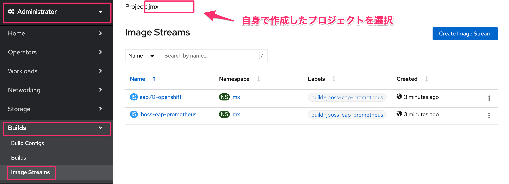

= 演習1 Lab2-1: Prometheus JMX Exporterの展開

== 1. 諸注意

=== 1-1. JMX Exporterについて

* JMX Exporter は2通りの動作を提供します。 +
Java Agent (推奨): Java Agent 用 JAR ファイルからメトリクスを収集 +
HTTP server: リモートの JMX ターゲットからメトリクスを取得し、HTTP サーバで公開
* Java Agent 用 JARファイルの配置方法は次の2通りです。 +
Docker Build Strategy: Dockerfile にビルド済み JAR ファイルを取得し配置 +
S2I: pom.xml に Dependency をセットし、S2I 実行時に Maven でビルド

=== 1-2. 事前準備

* 踏み台サーバー(Bastion Server)へのアクセス情報
* OpenShift4クラスターへのアクセス情報

== 2. アプリケーション展開

=== 2-1. OpenShift4へのログイン

. 踏み台サーバー(Bastion Server)にSSHでログインします。
+
[source,bash,role="execute"]
----
ssh -l {{ SSH_USERNAME }} {{ BASTION_FQDN }} -o ServerAliveInterval=120
----
+
あなたの ssh パスワードはこれです。
+
[source,bash,role="copypaste"]
----
{{ SSH_PASSWORD }}
----
+
. OpenShift4クラスターにocコマンドでログインします。
+
[source,bash,role="execute"]
----
oc login -u kubeadmin -p {{ KUBEADMIN_PASSWORD }} {{ API_URL }} 
----

. 次に、OpenShift4クラスターを構成するノードを確認します。
+
[source,bash,role="execute"]
----
oc get node
----
+
実行例)
+
----
 $ oc get node

 NAME                                              STATUS   ROLES    AGE   VERSION
 ip-10-0-128-108.ap-northeast-1.compute.internal   Ready    master   15h   v1.13.4+509f0153f
 ip-10-0-141-52.ap-northeast-1.compute.internal    Ready    worker   15h   v1.13.4+509f0153f
 ip-10-0-151-196.ap-northeast-1.compute.internal   Ready    worker   15h   v1.13.4+509f0153f
 ip-10-0-159-143.ap-northeast-1.compute.internal   Ready    master   15h   v1.13.4+509f0153f
 ip-10-0-162-88.ap-northeast-1.compute.internal    Ready    master   15h   v1.13.4+509f0153f
 ip-10-0-175-15.ap-northeast-1.compute.internal    Ready    worker   15h   v1.13.4+509f0153f
----
+
[TIPS]
====
NOTE: 上記のように、複数台のMasterとWorkerノードで構成されており、STATUSが Readyであることを確認します。
なお、ハンズオン環境においては、ノード台数が異なる場合があります。
====

=== 2-2. アプリケーションのビルド

. 監視対象アプリケーション用の「jmx」という名前のプロジェクトを作ります。
+
[source,bash,role="execute"]
----
oc new-project jmx 
----
+
[source,bash,role="execute"]
----
oc get project | grep jmx 
----
+
実行例)
+
----
$ oc new-project jmx
Now using project "jmx" on server "https://api.cluster-shibuya-7588.shibuya-7588.sandbox335.opentlc.com:6443".

You can add applications to this project with the 'new-app' command. For example, try:

    oc new-app ruby~https://github.com/sclorg/ruby-ex.git

to build a new example application in Ruby. Or use kubectl to deploy a simple Kubernetes application:

    kubectl create deployment hello-node --image=gcr.io/hello-minikube-zero-install/hello-node

$ oc get project | grep jmx
jmx                                                               Active
----
+
上記のように、作成したプロジェクト名が出力されることを確認します。

. アプリケーションをリポジトリからCloneして、「jboss-eap-prometheus」イメージをビルドします。
+
[source,bash,role="execute"]
----
git clone https://github.com/openlab-red/jboss-eap-prometheus
----
+
[source,bash,role="execute"]
----
cd ./jboss-eap-prometheus/
----
+
[source,bash,role="execute"]
----
oc new-build .
----
+
実行例)
+
----
$ git clone https://github.com/openlab-red/jboss-eap-prometheus
Cloning into 'jboss-eap-prometheus'...
remote: Enumerating objects: 43, done.
remote: Total 43 (delta 0), reused 0 (delta 0), pack-reused 43
Unpacking objects: 100% (43/43), done.
$ cd ./jboss-eap-prometheus/
$ oc new-build .
--> Found container image b72b49b (2 years old) from registry.access.redhat.com for "registry.access.redhat.com/jboss-eap-7/eap70-openshift:latest"

...(中略)

--> Creating resources with label build=jboss-eap-prometheus ...
    imagestream.image.openshift.io "eap70-openshift" created
    imagestream.image.openshift.io "jboss-eap-prometheus" created
    buildconfig.build.openshift.io "jboss-eap-prometheus" created
--> Success
----

. ビルドの状況をocコマンドと、OpenShift4コンソールからも確認します。
+
[source,bash,role="execute"]
----
oc logs -f bc/jboss-eap-prometheus
----
+
[source,bash,role="execute"]
----
oc get build
----
+
[source,bash,role="execute"]
----
oc get imagestream
----
+
実行例)
+
----
$ oc logs -f bc/jboss-eap-prometheus
Cloning "https://github.com/openlab-red/jboss-eap-prometheus" ...

...(中略)

Writing manifest to image destination
Storing signatures
Push successful
 ※イメージがPushされると自動的にログから開放されるので待つ。
 (もし「Errorとなってしまった場合は」、[Ctl] + [C]で出て再度やり直す)

$ oc get build
NAME                     TYPE     FROM          STATUS     STARTED          DURATION
jboss-eap-prometheus-1   Docker   Git@23160b8   Complete   38 minutes ago   1m28s

$ oc get imagestream
NAME                   IMAGE REPOSITORY                                                            TAGS     UPDATED
eap70-openshift        image-registry.openshift-image-registry.svc:5000/jmx/eap70-openshift        latest   7 minutes ago
jboss-eap-prometheus   image-registry.openshift-image-registry.svc:5000/jmx/jboss-eap-prometheus   latest   7 minutes ago

----
+
OpenShift4コンソールにログインして、[Builds]>[Image Streams]から、ビルドしたイメージがImageStreamに登録されていることも確認しましょう。
+

=== 2-3. アプリケーションのデプロイ

. アプリケーションの展開
+
ここでは、登録した「jboss-eap-prometheus」を利用して、アプリケーションを展開します。 +
 展開の際には、Java Agent用JARファイルやJMX Exporter設定ファイルのパスを環境変数(jmx-prometheus.jar=9404)で指定しておきましょう。
+
[source,bash,role="execute"]
----
export JBOSS_HOME=/opt/eap
----
+
[source,bash,role="execute"]
----
oc new-app -i jboss-eap-prometheus:latest \
  --name=jboss-eap-prometheus \
  -e PREPEND_JAVA_OPTS="-javaagent:${JBOSS_HOME}/prometheus/jmx-prometheus.jar=9404:${JBOSS_HOME}/prometheus/config.yaml"
----
+
実行例)
+
----
$ export JBOSS_HOME=/opt/eap
$ oc new-app -i jboss-eap-prometheus:latest \
  --name=jboss-eap-prometheus \
  -e PREPEND_JAVA_OPTS="-javaagent:${JBOSS_HOME}/prometheus/jmx-prometheus.jar=9404:${JBOSS_HOME}/prometheus/config.yaml"
--> Found image add9eb8 (14 minutes old) in image stream "jmx/jboss-eap-prometheus" under tag "latest" for "jboss-eap-prometheus:latest"

...(中略)

--> Success
    Application is not exposed. You can expose services to the outside world by executing one or more of the commands below:
     'oc expose svc/jboss-eap-prometheus'
    Run 'oc status' to view your app.
----

. 展開したアプリケーションの確認
+
この時点で「jboss-eap-prometheus-1」がRunning状態になれば、デプロイ成功です。 +
 JMX Exporter はデフォルトで9404ポートを公開します。
+
[source,bash,role="execute"]
----
oc get svc jboss-eap-prometheus
----
+
[source,bash,role="execute"]
----
oc get deploy jboss-eap-prometheus
----
+
[source,bash,role="execute"]
----
oc get pod
----
+
実行例)
+
----
$ oc get svc jboss-eap-prometheus
NAME                   TYPE        CLUSTER-IP       EXTERNAL-IP   PORT(S)                               AGE
jboss-eap-prometheus   ClusterIP   172.30.187.179   <none>        8080/TCP,8443/TCP,8778/TCP,9404/TCP   46s

$ oc get deploy jboss-eap-prometheus
NAME                   READY   UP-TO-DATE   AVAILABLE   AGE
jboss-eap-prometheus   1/1     1            1           52s

$ oc get pod
NAME                                   READY   STATUS      RESTARTS   AGE
jboss-eap-prometheus-1-build           0/1     Completed   0          111s
jboss-eap-prometheus-b8fccc765-jplx2   1/1     Running     0          57s
----
+
「jboss-eap-prometheus-b8fccc765-jplx2」(b8fccc765-jplx2はデプロイしたときにランダムに生成される)がRunning状態になるまで待ちましょう。

=== 2-4. アプリケーションのアノテーション設定

JMX ExporterのServiceに対して、アノテーションをつけておきます。

[source,bash,role="execute"]
----
oc annotate svc jboss-eap-prometheus prometheus.io/scrape='true'
----
[source,bash,role="execute"]
----
oc annotate svc jboss-eap-prometheus prometheus.io/port='9404'
----

=== 2-5. アプリケーションのルータ設定

「jboss-eap-prometheus」のアプリケーション(tcp-8080)ポートを、ルータに接続します。

[source,bash,role="execute"]
----
oc expose svc/jboss-eap-prometheus --name=tcp-8080 --port=8080
----
[source,bash,role="execute"]
----
oc get route tcp-8080
----

実行例)

----
$ oc expose svc/jboss-eap-prometheus --name=tcp-8080 --port=8080
route.route.openshift.io/tcp-8080 exposed

$ oc get route tcp-8080
NAME       HOST/PORT                                PATH   SERVICES               PORT   TERMINATION   WILDCARD
tcp-8080   tcp-8080-jmx.XXX.openshiftworkshop.com          jboss-eap-prometheus   8080                 None
----

Host/PortのURLにブラウザ上からアクセスすると、アプリケーションコンテンツが確認できます。

image::images/ocp4ws-ops/jboss-eap-prometheus-8080.jpg[Jboss Application]

次に「jboss-eap-prometheus」のPromtheus Exporter(tcp-9404)ポートを、ルータに接続します。

[source,bash,role="execute"]
----
oc expose svc/jboss-eap-prometheus --name=tcp-9404 --port=9404
----
[source,bash,role="execute"]
----
oc get route tcp-9404
----

実行例)

----
$ oc expose svc/jboss-eap-prometheus --name=tcp-9404 --port=9404
route.route.openshift.io/tcp-9404 exposed

$ oc get route tcp-9404
NAME       HOST/PORT                                PATH   SERVICES               PORT   TERMINATION   WILDCARD
tcp-9404   tcp-9404-jmx.XXX.openshiftworkshop.com          jboss-eap-prometheus   9404                 None
----

Host/PortのURLにブラウザ上からアクセスすると、JMX Exporterから取得したPromSQLのクエリが確認できます。

image::images/ocp4ws-ops/jboss-eap-prometheus-9404.jpg[Jboss Application]

これで、JMX Exporterの設定は完了です。次にlink:ocp4ws-ops-2-2[Prometheus Operator]の作業に進みます。
