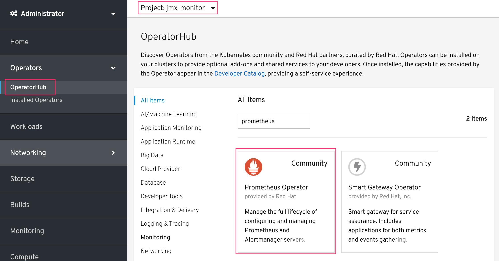
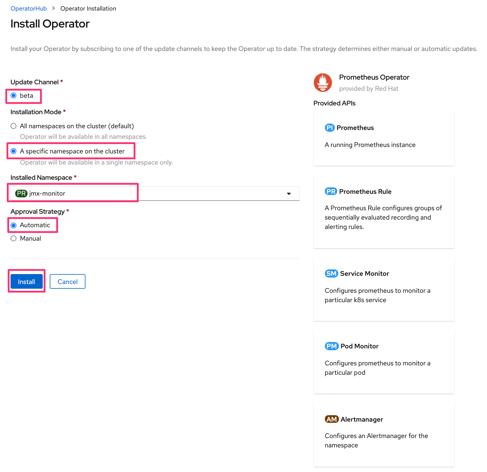
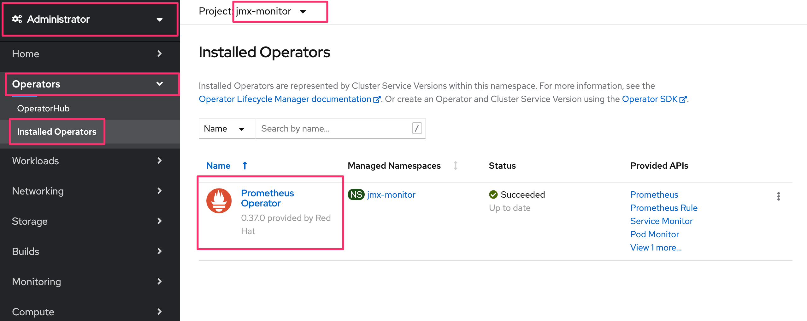

= 演習1 Lab2-2: Prometheus Operatorの展開

== 1. 諸注意

=== 1-1. Prometheus Operatorについて

PrometheusOperatorは、Kubernetesサービスの簡単な監視定義、およびPrometheusインスタンスの展開と管理を提供します。  +
Prometheus Operatorは次の機能を提供します。

* 容易なPrometheusの作成/破棄：Kubernetes名前空間、特定のアプリケーション、またはチーム用のPrometheusインスタンスをOperatorを使って簡単に起動できます。
* シンプルな設定：CRDを通してPrometheusのバージョン、永続性、保存ポリシー、レプリカなどの基本設定ができます。
* ラベルを介したターゲット：Kubernetesラベルクエリに基づいて、監視ターゲット構成を自動的に生成します。そのため、Prometheus固有の言語を学ぶ必要がありません。

=== 1-2. 事前準備

* 事前にJMX Exporterを用意しておく。
* 「OpenShift Webコンソール」のアドレス +

== 2. Prometheus Operatorの展開

=== 2-1. プロジェクト作成

Prometheus Operator用のプロジェクトを作成し、作成したプロジェクト名が出力されることを確認します。

[source,bash,role="execute"]
----
oc new-project jmx-monitor 
----
[source,bash,role="execute"]
----
oc get project | grep jmx-monitor
----

=== 2-2. Subscriptionを作成

ブラウザからOpenShift Webコンソールにログインし、[Operators]>[OperatorHub]からPrometheusを検索します。 +
この際、プロジェクトが「jmx-monitor」であることを確認しておきましょう。

OperatorHubの中から、Prometheus Operator(Community)を選択して、[Install]を行います。 +
※コミュニティ版を利用すると、警告が表示されるので、一旦[Continue]で続けます。(OCP 4.5現在)

image::images/ocp4ws-ops/prometheus-operator.png[Prometheus Operator]

image::images/ocp4ws-ops/prometheus-operator-subscription.png[]

Subscriptionは、以下の設定で作成します。

* Update Channel +
beta
* Installation Mode +
A specific namespace on the cluster: [PR] jmx-monitor
* Approval Strategy +
Automatic

実際にGUI上では以下のように設定します。

[TIPS]
====
NOTE: OperatorHubの画面で表示されるOperatorの一覧は、ocコマンドでも見ることができます。

[source,bash,role="execute"]
----
oc get packagemanifest -n openshift-marketplace
----

次のように、`oc describe` を使うことでWebコンソールのOperatorHubでは表示されないような、各Operatorの詳細な情報を得ることができます。

[source,bash,role="execute"]
----
oc describe packagemanifest prometheus -n openshift-marketplace
----

例えば、Installation Modeに注目してみると、Webコンソールでは、

* All namespaces on the cluster 
* A specific namespace on the cluster

の2つが表示されていました。一方、`oc describe` の出力では、次のような表示を見つけることができます。
----
      Install Modes:
        Supported:  true
        Type:       OwnNamespace
        Supported:  true
        Type:       SingleNamespace
        Supported:  false
        Type:       MultiNamespace
        Supported:  true
        Type:       AllNamespaces
----
これらのInstall Modeは下表のような特徴があります。内部的にはこれらをtrueとfalseで制御をしていることがわかります。
|===
| InstallMode | Action

| OwnNamespace
| Operatorは、独自のnamespace を選択するOperatorGroupのメンバーにできます。

| SingleNamespace
| Operatorは1つのnamespace を選択するOperatorGroupのメンバーにできます。

| MultiNamespace
| Operatorは複数の namespace を選択するOperatorGroupのメンバーにできます。

| AllNamespaces
| Operatorはすべての namespace を選択するOperatorGroupのメンバーできます (ターゲット namespace 設定は空の文字列 "" です)。
|===
====

正しくSubscriptionが設定されると、[UPGRADE STATUS]がInstalledになりOperatorが展開されます。また、以下のように[Operators]>[Installed Operators]>[Operator Details]>[Subscription]から、Subscriptionの概要が確認できます。

image::images/ocp4ws-ops/create-subscription-overview.png[]

これで、Prometheus OperatorのSubscriptionが作成されました。なおこの時点では、CRDの登録やPrometheus Operatorの配置が行われるだけで、Prometheusのプロセス自体は構築されません。

== 3. CRD/Operatorの確認

Prometheus OperatorのSubscriptionを作成すると、CRD(Custom Resource Definition)が作成されます。
[source,bash,role="execute"]
----
oc get crd | grep monitoring.coreos.com
----

実行例)

----
$ oc get crd | grep monitoring.coreos.com
alertmanagers.monitoring.coreos.com                         2020-08-27T01:38:39Z
podmonitors.monitoring.coreos.com                           2020-08-27T01:38:39Z
prometheuses.monitoring.coreos.com                          2020-08-27T01:38:39Z
prometheusrules.monitoring.coreos.com                       2020-08-27T01:38:39Z
servicemonitors.monitoring.coreos.com                       2020-08-27T01:38:39Z
thanosrulers.monitoring.coreos.com                          2020-08-27T01:38:39Z
----

Promethus Operatorは、標準で5つのCRDを保持しています。 +
GUIからは [Operators]>[Installed Operators]>[Prometheus Operator] をから、オペレーターカタログとして、デプロイされたPromethus OperatorのCRDが確認できます。

image::images/ocp4ws-ops/prometheus-catalog.png[Prometheus Catalog]

また、Prometheus OperatorがOLM(Operator Lifecycle Manager)によって配置されます。
[source,bash,role="execute"]
----
oc get pod
----

実行例)

----
$ oc get pod
NAME                                  READY   STATUS    RESTARTS   AGE
prometheus-operator-bd98985fd-vcnw6   1/1     Running   0          5m52s
----

'''

以上で、Promethus Operatorの準備が整いました。次のlink:ocp4ws-ops-2-3[CustomResourceの設定]作業に進みます。
