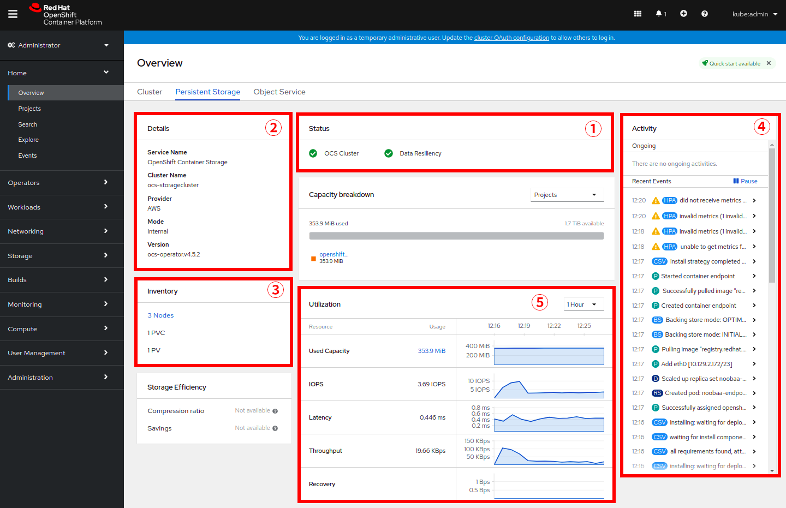
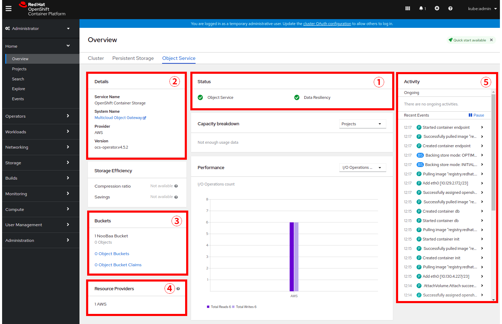

:experimental:

= 演習2 Lab2: OCSクラスターを作成する

== Labの概要
このLabでは OpenShift Container Storage(OCS) Operatorをインストールし、OCSクラスターを作成します。 +
OCS OperatorのインストールとOCSクラスターの作成は、CLIでも行えますが、本Labではより簡単なGUI(Web Console)を使って行います。

=== このLabで学習する内容

* OCPクラスターにOCS Operatorをインストールする
* OCS Operatorを使ってOCSクラスターを作成する
* 作成したOCSクラスター(Ceph)を確認する。

---

[[labexercises]]

== 2-1. OCPクラスターにOCS Operatorをインストールする

このセクションでは、Web ConsoleのOperatorHubからOCS Operatorをインストールします。 +

はじめに *Openshift Web Console* を開きます。

{{ MASTER_URL }}

`kubeadmin` としてログインしましょう。パスワードはこちらです。

[source,role="copypaste"]
----
{{ KUBEADMIN_PASSWORD }}
----

ログインしたらWeb Console左側メニューから、*Operators* -> *OperatorHub* を選択します。

.OCP OperatorHub
image::images/ocs/OCS-OCP-OperatorHub.png[OCP OperatorHub]

*Filter by _keyword..._* のボックスに、`openshift container storage` と入力すると、`OpenShift Container Storage Operator` が表示されます。

.OCP OperatorHub filter on OpenShift Container Storage Operator
image::images/ocs/OCS4-OCP-OperatorHub-Filter.png[OCP OperatorHub Filter]

表示された `OpenShift Container Storage Operator` を選択し、 *Install* ボタンを押します。

.OCP OperatorHub Install OpenShift Container Storage
image::images/ocs/OCS4.5-OCP-OperatorHub-Install.png[OCP OperatorHub Install]

次の画面で、設定が下図に示す通りであることを確認し、*Subscribe* をクリックします。

.OCP Subscribe to OpenShift Container Storage
image::images/ocs/OCS4.5-OCP-OperatorHub-Subscribe.png[OCP OperatorHub Subscribe]

CAUTION: `Installed Namespace` は上記のとおり、**"Operator recommended namespace: (PR) openshift-storage"** を選択して下さい。`openshift-storage` namespace以外では、OCSはインストールされません。 +

NOTE: 事前に `openshift-storage` namespaceを作成していませんが、OCS Operatorが自動で作成するので問題ありません。 +
また、**"Enable operator recommended cluster monitoring on this namespace"**のチェックボックスをチェックしておくと、OCSをOpenShift Monitoringの対象に加えることができるので、チェックしておきましょう。

次はターミナルに戻って、下のコマンドを実行してOCS Operatorのインストール状況を確認できます。

[source,role="execute"]
----
watch oc get csv -n openshift-storage
----
.出力例:
----
NAME                            DISPLAY                       VERSION   REPLACES   PHASE
ocs-operator.v4.5.2             OpenShift Container Storage   4.5.2                Succeeded
----
kbd:[Ctrl+C]を押すと終了できます。

.Operatorの `PHASE` が `Succeeded` に変わるまで待って下さい。
CAUTION: 変わるまで数分かかる場合があります。

OCS Operatorのインストールが終わると、いくつかの新しいPodが `openshift-storage` namespaceに作成されていることが確認できます。

[source,role="execute"]
----
oc get pods -n openshift-storage
----
.出力例:
----
NAME                                     READY   STATUS    RESTARTS   AGE
noobaa-operator-58d8fbb457-hg495         1/1     Running   0          2m6s
ocs-operator-66c778887d-8qkqm            1/1     Running   0          2m6s
rook-ceph-operator-98b4c45c9-zxlxz       1/1     Running   0          2m6s
----

ここでは3つのOperator Podが表示されています。最初にOCS Operator Podが実行されます。OCS Operatorが実行されることでRook-Ceph OperatorとNooBaa Operatorの2つのOperator Podがデプロイされます。

以上で、OCS Operatorのインストールができました。

== 2-2. OCS Operatorを使ってOCSクラスターを作成する

それではOCPのPersistent Storageとなる、OCSクラスターを作成します。 +
*Openshift Web Console* に戻ってOCSのインストールを確認してみましょう。

左側のメニューから *Operators* -> *Installed
Operators* を選択します。Projectは `openshift-storage` を選択します。 +
以下のような画面になっているはずです。

.Installed Operators in the openshift-storage namespace
image::images/ocs/OCS4.5-installed-operators.png[Openshift showing the installed operators in namespace openshift-storage]

`Openshift Container Storage Operator` をクリックすると、次のようなOCS Operatorの詳細画面に移動します。

.OCS configuration screen
image::images/ocs/OCS4.5-config-screen-all.png[OCS configuration screen]

画面に表示される `Storage Cluster` の中にある、 *Create instance* をクリックします。 +
次のような画面が表示されます。

.OCS create a new storage cluster
image::images/ocs/OCS4.5-config-screen.png[OCS create a new storage cluster]

以下の手順でOCSクラスターの設定をします。

. *Select Mode* では `Internal`を選択します。
+
NOTE: 他の *Select Mode* の `Internal - Attached Devices` は、Baremetal方式でインストールしたOCPクラスターでOCSを構成する場合や、AWS EBSではないEC2 Instanceに元から存在するデバイスを使ってOCSクラスターを構成する場合に使います。 +
また `External` は、OCPクラスターの外に存在する Red Hat Ceph Storage をOCSクラスターとして使用する、External Mode という特殊なケースで使います。
+
. *Storage Class* には `gp2` を指定し、*OCS Service Capacity* には `2 TiB` を指定します。
+
NOTE: *Storage Class* は作っていませんが、デフォルトで `gp2` が指定されています。これは、OCPのCluster Storage OperatorがOCPクラスターが稼働するプラットフォーム(このLabではAWS)を自動で認識し、そのプラットフォームに相応しいデフォルトのStorage Classを自動的に設定するためです。 +
また *OCS Service Capacity* は、AWSの環境では、0.5 TiB, 2 TiB, 4 TiB の3つから選択できます。
+
CAUTION: *ここで選択した OCS Service Capacity は、将来容量を拡張する際の最小単位として利用されます。* +
例えば初めに2 TiBを選択した場合は、以降は 2TiB 単位で拡張することになります。
+
. OCSクラスターで使うnodeを指定します。
+
はじめから3つのworker nodeが選択されているはずです。これはOCS用のラベル `cluster.ocs.openshift.io/openshift-storage` が付けられたnodeが自動で選択されています。以下のコマンドを実行して、確かに間違いがないことを確認してみましょう。
+
[source,role="execute"]
----
oc get nodes -l 'cluster.ocs.openshift.io/openshift-storage' | cut -d' ' -f1
----
+
CAUTION: *OCSクラスターを構成するには、3つの異なるAvailability Zoneのworker nodeを選択することが必要です。異なるAvailability Zoneではないworker nodeを選択することはサポートされません。*
+
4. 全て指定したら、*Create* をクリックします。

これで、自動的にOCSクラスターが作成されます。+
ターミナルで次のコマンドを実行しておくと、次々とPodが作成される様子が確認できます。

[source,role="execute"]
----
watch oc get pods -n openshift-storage
----
.出力例
----
NAME                                                              READY   STATUS      RESTARTS   AGE
csi-cephfsplugin-6qvmf                                            3/3     Running     0          17m
csi-cephfsplugin-8rqr5                                            3/3     Running     0          17m
csi-cephfsplugin-ctr66                                            3/3     Running     0          17m
csi-cephfsplugin-m7xfp                                            3/3     Running     0          17m
csi-cephfsplugin-provisioner-65b59d9dc9-bb9c5                     5/5     Running     0          17m
csi-cephfsplugin-provisioner-65b59d9dc9-tclkw                     5/5     Running     0          17m
csi-cephfsplugin-wslm9                                            3/3     Running     0          17m
csi-cephfsplugin-zt76r                                            3/3     Running     0          17m
csi-rbdplugin-5dx5r                                               3/3     Running     0          17m
csi-rbdplugin-5kg88                                               3/3     Running     0          17m
csi-rbdplugin-g8tzm                                               3/3     Running     0          17m
csi-rbdplugin-gn27b                                               3/3     Running     0          17m
csi-rbdplugin-jrnh9                                               3/3     Running     0          17m
csi-rbdplugin-provisioner-86c8bc888d-6xfbr                        5/5     Running     0          17m
csi-rbdplugin-provisioner-86c8bc888d-ks6zv                        5/5     Running     0          17m
csi-rbdplugin-x9nqb                                               3/3     Running     0          17m
noobaa-core-0                                                     1/1     Running     0          14m
noobaa-db-0                                                       1/1     Running     0          14m
noobaa-endpoint-7f5fff7d49-554qs                                  1/1     Running     0          12m
noobaa-operator-b77ccff86-4lvks                                   1/1     Running     0          93m
ocs-operator-6dd9fd9d8d-8gpj5                                     1/1     Running     0          93m
rook-ceph-crashcollector-ip-10-0-141-60-85445fcd84-4lcbv          1/1     Running     0          15m
rook-ceph-crashcollector-ip-10-0-147-83-54cf7f47c9-msjgn          1/1     Running     0          16m
rook-ceph-crashcollector-ip-10-0-166-106-9d874cdb4-cjrrt          1/1     Running     0          15m
rook-ceph-drain-canary-69e8faf0c5145b285b2bef426fecc57e-66glnz5   1/1     Running     0          14m
rook-ceph-drain-canary-930e025127d0657f5254c19f87943be3-bdx9sh6   1/1     Running     0          14m
rook-ceph-drain-canary-cd3910173d92c098f7310ab3eb082fce-56j2pkd   1/1     Running     0          14m
rook-ceph-mds-ocs-storagecluster-cephfilesystem-a-7646cc945x56v   1/1     Running     0          13m
rook-ceph-mds-ocs-storagecluster-cephfilesystem-b-58b5fd94rww7b   1/1     Running     0          13m
rook-ceph-mgr-a-97f7f799b-d9fhk                                   1/1     Running     0          14m
rook-ceph-mon-a-b5cd8d595-njmzk                                   1/1     Running     0          16m
rook-ceph-mon-b-d89df794d-cpj6n                                   1/1     Running     0          15m
rook-ceph-mon-c-5f989bbff-lc8b8                                   1/1     Running     0          15m
rook-ceph-operator-599dbd974f-nm4nz                               1/1     Running     0          93m
rook-ceph-osd-0-7795b7c779-glk4g                                  1/1     Running     0          14m
rook-ceph-osd-1-7877cd76c5-dxxzg                                  1/1     Running     0          14m
rook-ceph-osd-2-7544dc9db-vq7gj                                   1/1     Running     0          14m
rook-ceph-osd-prepare-ocs-deviceset-0-0-wlsqw-bg5bl               0/1     Completed   0          14m
rook-ceph-osd-prepare-ocs-deviceset-1-0-nxc46-p7s97               0/1     Completed   0          14m
rook-ceph-osd-prepare-ocs-deviceset-2-0-qxd7g-h9hkb               0/1     Completed   0          14m
----
kbd:[Ctrl+C]を押すと終了できます。

すべてのPodの `STATUS` が `Running` または `Completed` になるとインストールは完了です。

OperatorとOpenShiftの素晴らしいところは、デプロイされたコンポーネントに関するインテリジェンスをOperatorが内蔵していることです。
また、Operatorは `CustomResource` を定義します。そのため `CustomResource` 自体を見ることでステータスを確認することができます。 +
OCSを例にすると、OCSクラスターをデプロイすると最終的には `StorageCluster` のインスタンスが生成されていることが分かります。この `StorageCluster` は OCS Operator によって定義された `CustomeResource` です。

[source,role="execute"]
----
oc get storagecluster -n openshift-storage
----

`StorageCluster` のステータスは次のようにチェックできます。

[source,role="execute"]
----
oc get storagecluster -n openshift-storage ocs-storagecluster -o jsonpath='{.status.phase}{"\n"}'
----

`Ready` となっていれば、続けることができます。

以上で、OCSクラスターの作成ができました。

== 2-3. 作成したOCSクラスター(Ceph)を確認する。
このLabでは、作成したOCSクラスターを *Web Console* に作られるダッシュボードを使って確認します。 +
また、CLIでOCSクラスターのコア部分であるCephを操作して、より詳細な構成を確認してみます。

=== ストレージダッシュボードを使用する

このセクションでは、*Web Console* に含まれている、OCS独自のダッシュボードを使ってストレージクラスターのステータスを確認します。 +
ダッシュボードは左側のメニューバーから *Home* -> *Overview* とクリックし、 `Persistent Storage` タブを選択することでアクセスできます。

NOTE: OCSのデプロイが完了したばかりの場合、ダッシュボードが完全に表示されるまでに5〜10分かかります。

.OCS Dashboard after successful backing storage installation

[cols="0,1,10a"]
|===
|① | Status | クラスターの全体的なステータス
|② | Details | デプロイされたクラスターのバージョンとプロバイダーの概要
|③ | Inventory | ストレージシステムによって使用および提供されるすべてのリソースのリスト
|④ | Activity | クラスターで起きている全ての変更の概要
|⑤ | Utilization | ストレージクラスターの使用とパフォーマンスの概要
|===

MCGによって提供されるObject Storeサービスのダッシュボードも付属しています。`Persistent Storage` の横にある `Object Service` のタブを選択することでアクセスできます。

.OCS Multi-Cloud-Gateway Dashboard after successful installation

[cols="0,1,10a"]
|===
|① | Status | Multi-Cloud Gateway(MCG)の全体的なステータス
|② | Details | MCGダッシュボードへのリンクを含む、デプロイされたMCGバージョンとプロバイダーの概要
|③ | Buckets | すべてのObjectBucketとそれらに接続されているObjectBucketClaimsのリスト
|④ | Resource Providers | MCGのバックエンドストレージとして利用可能な設定済みのリソースプロバイダーのリスト
|⑤ | Activity | クラスターで起きている全ての変更の概要
|===

すべて正常なステータスになったら、OCSのデプロイ中に作成された3つの新しい *StorageClass* を使用できるようになります。

- ocs-storagecluster-ceph-rbd
- ocs-storagecluster-cephfs
- openshift-storage.noobaa.io

*Storage* メニューの *Storage Classes* を選択することで、これら3つの *StorageClass* が表示されます。 +
また、以下のコマンドでも確認できます。

[source,role="execute"]
----
oc get sc -n openshift-storage
----

先に進む前に、3つのStorageClassが使用可能であることを確認してください。

NOTE: NooBaaは `noobaa-core` Pod内部の `db` コンテナで利用するために `ocs-storagecluster-ceph-rbd` StorageClassを使用してPVCを作成しています。

=== Rook-Ceph toolboxを利用してCephクラスターを確認する

このセクションでは、Rook-Ceph *toolbox* を利用して作成されたCephクラスターに対してcephコマンドを実行し、クラスター構成を確認します。

以下のコマンドで `OCSInitialization ocsinit` を修正します。

[source,role="execute"]
----
oc patch OCSInitialization ocsinit -n openshift-storage --type json --patch  '[{ "op": "replace", "path": "/spec/enableCephTools", "value": true }]'
----

`rook-ceph-tools` *Pod* が `Running` になれば、次のようにtoolbox Podに入ることができます。

[source,role="execute"]
----
TOOLS_POD=$(oc get pods -n openshift-storage -l app=rook-ceph-tools -o name)
oc rsh -n openshift-storage $TOOLS_POD
----

toolbox Podに入ったら、次のcephコマンドを実行してみて下さい。これらのコマンドによってCephクラスターの詳細な構成を確認することができます。

[source,role="execute"]
----
ceph status
----

[source,role="execute"]
----
ceph osd status
----

[source,role="execute"]
----
ceph osd tree
----

[source,role="execute"]
----
ceph df
----

[source,role="execute"]
----
rados df
----

[source,role="execute"]
----
ceph versions
----

.出力例
----
sh-4.2# ceph status
  cluster:
    id:     bcc52257-12b7-4401-9f8d-c7b5bf4b5d6f
    health: HEALTH_OK
 
  services:
    mon: 3 daemons, quorum a,b,c (age 11m)
    mgr: a(active, since 10m)
    mds: ocs-storagecluster-cephfilesystem:1 {0=ocs-storagecluster-cephfilesystem-a=up:active} 1 up:standby-replay
    osd: 3 osds: 3 up (since 9m), 3 in (since 9m)
 
  data:
    pools:   3 pools, 24 pgs
    objects: 90 objects, 75 MiB
    usage:   3.1 GiB used, 6.0 TiB / 6.0 TiB avail
    pgs:     24 active+clean
 
  io:
    client:   1.2 KiB/s rd, 42 KiB/s wr, 2 op/s rd, 2 op/s wr
----

kbd:[Ctrl+D] を押すか、 `exit` を実行してtoolboxから出ることができます.

[source,role="execute"]
----
exit
----

---
以上で、「Lab2: OCSクラスターを作成する」は完了です。 +
次は link:ocs4-3[Lab3: OCSが提供するRWO PVを使用する] に進みます。
